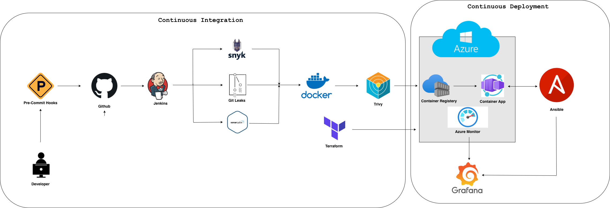
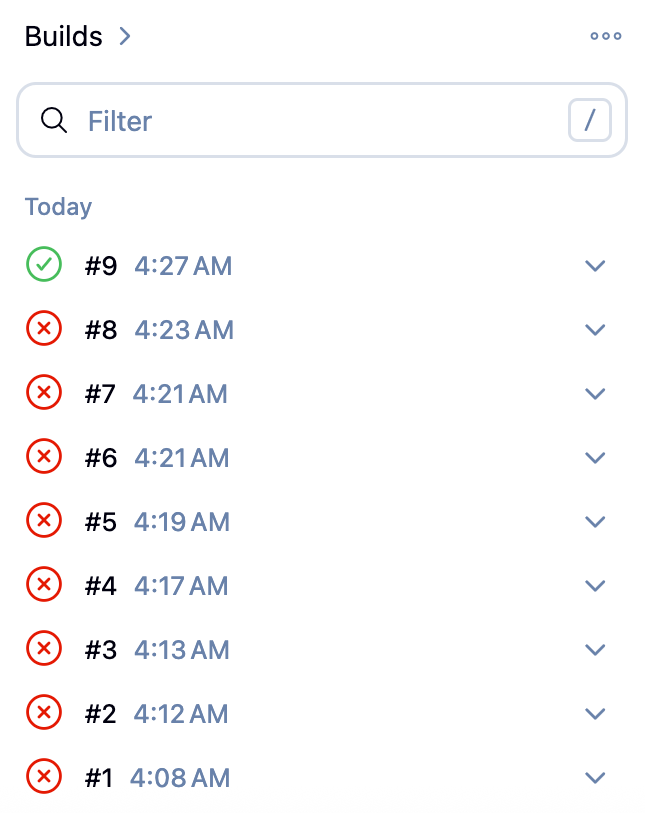
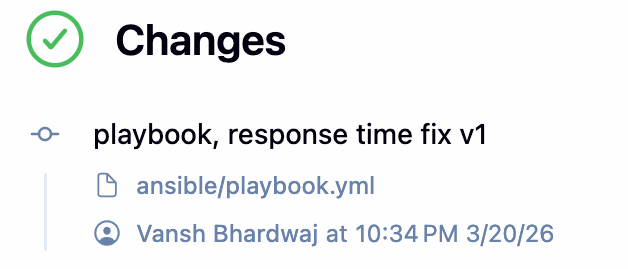
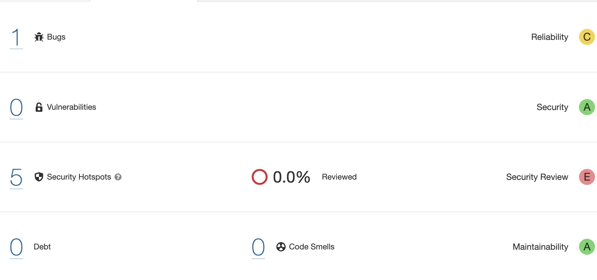
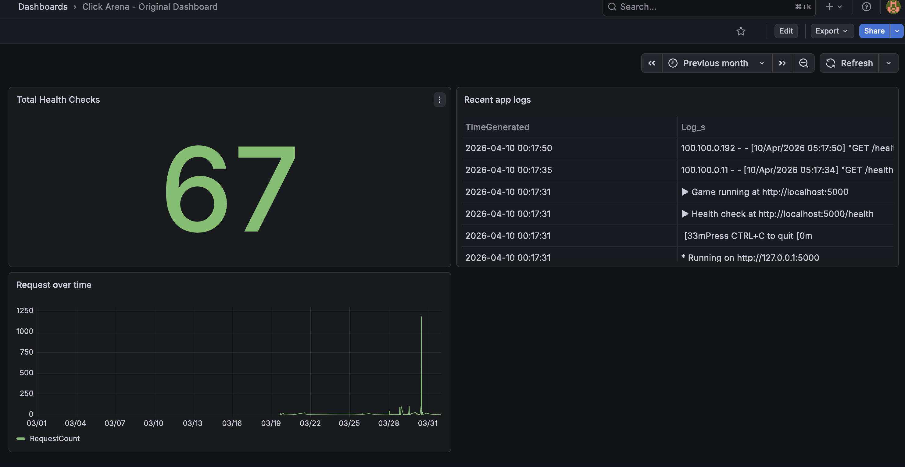

# Click Arena — DevSecOps Pipeline Project


<figure>
  
</figure>


## Table of Contents

1. [Overview](#overview)
2. [What is this project?](#what-is-this-project)
3. [Tech Stack and Tools](#tech-stack-and-tools)
4. [Project Structure](#project-structure)
5. [The Application](#the-application)
6. [Containerization](#containerization)
7. [Azure Infrastructure](#azure-infrastructure)
8. [Infrastructure as Code with Terraform](#infrastructure-as-code-with-terraform)
9. [CI/CD Pipeline with Jenkins](#cicd-pipeline-with-jenkins)
10. [Post-Deploy Verification with Ansible](#post-deploy-verification-with-ansible)
11. [Security Scanning](#security-scanning)
12. [Secret Detection — Gitleaks](#secret-detection--gitleaks)
13. [Cloudflare Worker — Edge Middleware](#cloudflare-worker--edge-middleware)
14. [Monitoring — Azure Monitor + Grafana](#monitoring--azure-monitor--grafana)

---

## Overview

Click Arena is a real-time multiplayer browser game built as a vehicle for learning and demonstrating a full DevSecOps pipeline on Azure. Players click targets that appear on screen and compete on a live leaderboard, with real-time chat between players.


**The game is intentionally simple. The infrastructure is the point.**

**Live demo:** [https://click-arena.mangobush-de01fc2e.eastus.azurecontainerapps.io](https://click-arena.mangobush-de01fc2e.eastus.azurecontainerapps.io)

**Skills demonstrated:**

- Real-time multiplayer with Python, Flask, and WebSockets
- Containerization with Docker
- Private image storage with Azure Container Registry
- Serverless container hosting with Azure Container Apps
- Infrastructure as Code with Terraform
- CI/CD automation with Jenkins
- Post-deploy verification with Ansible
- Static code analysis with SonarQube
- Dependency vulnerability scanning with Snyk
- Container image scanning with Trivy
- Secret detection with Gitleaks (Jenkins pipeline + pre-commit hooks)
- Edge middleware with Cloudflare Workers
- Observability with Azure Monitor and Grafana
- Cost-conscious Azure architecture (scales to zero when idle)

---

## What is this project?

This project builds a full DevSecOps pipeline around a simple multiplayer game. Every tool in the stack has a real job — not a tutorial exercise. The game gives the pipeline something concrete to build, scan, deploy, and monitor.

The pipeline covers the full lifecycle: code is scanned for secrets before it commits, scanned for vulnerabilities before it ships, packaged into a container, pushed to a private registry, deployed to Azure via infrastructure defined as code, verified post-deploy, and monitored in production via a live Grafana dashboard.

This is being built and documented as a hands-on learning project while studying for the AZ-104 exam.

---

## Tech Stack and Tools

| Tool / Technology | Purpose |
|---|---|
| Python 3.11 | Application language |
| Flask | Web framework and HTTP routing |
| Flask-SocketIO | Real-time WebSocket communication |
| Docker | Containerization |
| Azure Container Registry | Private Docker image storage |
| Azure Container Apps | Serverless container hosting |
| Azure Log Analytics Workspace | Log collection for Container Apps |
| Terraform | Infrastructure as Code |
| Jenkins | CI/CD pipeline orchestration |
| Ansible | Post-deploy verification |
| Gitleaks | Secret detection in CI pipeline and pre-commit |
| SonarQube | Static code analysis / SAST |
| Snyk | Dependency vulnerability scanning / SCA |
| Trivy | Container image security scanning |
| Cloudflare Worker | Edge middleware — security headers, API key validation, cron audit |
| Azure Monitor | Log ingestion and metrics collection |
| Grafana | Observability dashboard |
| Git / GitHub | Version control |
| Azure CLI | Resource management and scripting |

---

## Project Structure

```
click-arena/
├── app/
│   ├── server.py              # Entry point — initializes Flask and SocketIO
│   ├── game.py                # WebSocket event handlers and target spawner
│   ├── routes.py              # HTTP routes (/, /health, /stats)
│   ├── state.py               # Shared in-memory game state
│   ├── requirements.txt       # Python dependencies
│   └── templates/
│       └── index.html         # Game frontend — single HTML file
├── cloudflare/
│   └── click-arena-headers/
│       ├── src/
│       │   └── index.js       # Cloudflare Worker — middleware logic
│       └── wrangler.jsonc     # Worker config — name, routes, cron schedule
├── terraform/
│   ├── main.tf                # Azure resource definitions
│   ├── providers.tf           # Terraform and AzureRM provider configuration
│   ├── variables.tf           # Input variable declarations
│   └── outputs.tf             # Outputs printed after apply
├── ansible/
│   └── playbook.yml           # Post-deploy verification playbook
├── jenkins/
│   └── Jenkinsfile            # CI/CD pipeline definition
├── docs/
│   └── screenshots/           # Pipeline and deployment screenshots
├── .pre-commit-config.yaml    # Pre-commit hooks configuration
├── .gitleaks.toml             # Gitleaks allowlist for known false positives
├── Dockerfile                 # Container build instructions
├── .dockerignore              # Files excluded from Docker build context
├── .gitignore
└── README.md
```

---

## The Application

The server is split across four files to keep concerns separate:

- `state.py` holds shared in-memory game state — connected players, active targets, and the last 20 chat messages. Everything resets on restart. No database — scores are intentionally ephemeral because the pipeline is the point.
- `game.py` registers all WebSocket event handlers: connect, join, click_target, chat_message, disconnect. A background thread keeps exactly three targets on screen at all times.
- `routes.py` handles three HTTP routes: `/` serves the game page, `/health` returns a JSON status object used by Azure and Jenkins, `/stats` returns live game metrics protected by the Cloudflare Worker API key check.
- `server.py` is the entry point — initializes Flask and SocketIO, registers routes and events, starts the background target spawner.

### Running Locally

```bash
git clone https://github.com/VanshBhardwaj1945/Click-Arena-DevSecOps.git
cd Click-Arena-DevSecOps

python3 -m venv .venv
source .venv/bin/activate
pip3 install -r app/requirements.txt
python3 -m app.server
# Visit http://localhost:8080
```

> *Python 3.14 introduced a breaking change with eventlet. The server uses `async_mode='threading'` instead, which works across all Python versions. Port 8080 is used locally to avoid macOS AirPlay Receiver which occupies port 5000.*

---

## Containerization

```dockerfile
FROM python:3.11-slim
WORKDIR /app
COPY app/requirements.txt .
RUN pip install --no-cache-dir -r requirements.txt
COPY app/ ./app/
EXPOSE 5000
CMD ["python3", "-m", "app.server"]
```

Dependencies are copied and installed before application code — Docker caches each layer, so unchanged dependencies don't trigger a reinstall on every build.

```bash
docker build -t click-arena .
docker run -p 8080:5000 click-arena
```

---

## Azure Infrastructure

### Resources Created

| Resource | Name | Purpose |
|---|---|---|
| Resource Group | `click-arena-rg` | Logical container for all project resources |
| Container Registry | `clickarenaregistry` | Private storage for Docker images |
| Log Analytics Workspace | `click-arena-logs` | Log collection for Container Apps environment |
| Container Apps Environment | `click-arena-env` | Shared hosting platform for Container Apps |
| Container App | `click-arena` | The running game server with public ingress |

All resources in East US. Container Apps scales to zero when idle — hosting cost is effectively zero. Only ongoing cost is ACR at approximately $5/month.

### Manual Setup

```bash
az group create --name click-arena-rg --location eastus

az acr create \
  --resource-group click-arena-rg \
  --name clickarenaregistry \
  --sku Basic \
  --admin-enabled true

az containerapp env create \
  --name click-arena-env \
  --resource-group click-arena-rg \
  --location eastus

az containerapp create \
  --name click-arena \
  --resource-group click-arena-rg \
  --environment click-arena-env \
  --image clickarenaregistry.azurecr.io/click-arena:v1 \
  --registry-server clickarenaregistry.azurecr.io \
  --target-port 5000 \
  --ingress external \
  --min-replicas 1 \
  --max-replicas 3
```

---

## Infrastructure as Code with Terraform

**Source:** [`terraform/`](./terraform/)

All Azure infrastructure declared in version-controlled `.tf` files. `terraform destroy` tears everything down cleanly. `terraform apply` rebuilds it identically.

### Resources Managed

| Resource Type | Terraform Label | Azure Name |
|---|---|---|
| `azurerm_resource_group` | `mainRG` | `click-arena-rg` |
| `azurerm_container_registry` | `mainACR` | `clickarenaregistry` |
| `azurerm_log_analytics_workspace` | `mainLA` | `click-arena-logs` |
| `azurerm_container_app_environment` | `mainCAE` | `click-arena-env` |
| `azurerm_container_app` | `main` | `click-arena` |

### Key Issues Resolved During Import

| Issue | Resolution |
|---|---|
| `logs_destination` argument not valid | Removed — not supported in `azurerm` 3.x |
| Container App Environment forced replacement | Existing environment had no Log Analytics workspace — Azure requires recreation to add one |
| Environment deletion hung 20+ minutes | Used `terraform state rm` to remove stuck resource, reapplied cleanly |
| Inconsistent resource labels | Standardized all labels before applying |

```bash
cd terraform
terraform init
terraform plan
terraform apply
```

---
## CI/CD Pipeline with Jenkins

<figure>
  
  <figcaption>Build history showing failures during debugging, ending in a successful green build</figcaption>
</figure>

Jenkins runs self-hosted in a Docker container. The pipeline executes locally and deploys to Azure via a Service Principal. Nothing runs on GitHub's servers.

### Setup

```bash
docker run -d \
  --name jenkins \
  -u root \
  --restart unless-stopped \
  -p 8090:8080 \
  -p 50000:50000 \
  -v jenkins_home:/var/jenkins_home \
  -v /var/run/docker.sock:/var/run/docker.sock \
  jenkins/jenkins:lts

# Tools installed inside container after first launch
docker exec -it jenkins apt-get install -y docker.io ansible trivy
docker exec -it jenkins bash -c "curl -sL https://aka.ms/InstallAzureCLIDeb | bash"
docker exec -it jenkins bash -c "npm install -g snyk"
docker exec -it jenkins bash -c "
    wget https://binaries.sonarsource.com/Distribution/sonar-scanner-cli/sonar-scanner-cli-5.0.1.3006-linux.zip -P /tmp &&
    unzip /tmp/sonar-scanner-cli-5.0.1.3006-linux.zip -d /opt &&
    ln -s /opt/sonar-scanner-5.0.1.3006-linux/bin/sonar-scanner /usr/local/bin/sonar-scanner
"
docker exec -it jenkins bash -c "
    wget https://github.com/gitleaks/gitleaks/releases/download/v8.18.2/gitleaks_8.18.2_linux_x64.tar.gz -P /tmp &&
    tar -xzf /tmp/gitleaks_8.18.2_linux_x64.tar.gz -C /usr/local/bin gitleaks
"
docker exec jenkins git config --global --add safe.directory '*'
```

### Pipeline Stages

| Stage | What it does |
|---|---|
| Checkout | Pulls latest code from GitHub |
| Secret Scan — Gitleaks | Scans codebase for leaked secrets and credentials |
| SAST — SonarQube | Scans Python source code for bugs and security hotspots |
| SCA — Snyk | Scans dependencies for known CVEs |
| Build Docker Image | Builds and tags container image with Jenkins build number |
| Container Scan — Trivy | Scans built image for OS-level CVEs before push |
| Push to ACR | Pushes tagged image to Azure Container Registry |
| Deploy to Container App | Updates running container via Azure CLI Service Principal |
| Ansible Verification | Structured post-deploy health checks against live URL |
| Smoke Test | Final `/health` endpoint confirmation |

### Credentials

| Credential ID | Purpose |
|---|---|
| `ACR_PASSWORD` | Azure Container Registry password |
| `ACR_USERNAME` | Azure Container Registry username |
| `AZURE_CREDENTIALS` | Service Principal JSON for `az login` |
| `SONAR_TOKEN` | SonarQube analysis token |
| `SNYK_TOKEN` | Snyk API token |

### Key Issues Resolved

| Issue | Resolution |
|---|---|
| Docker permission denied on every restart | Running as root (`-u root`) gives permanent socket access |
| `az login` state not persisting | Installed Azure CLI directly in Jenkins — login persists in same shell session |
| Git safe directory error after container recreation | `git config --global --add safe.directory '*'` inside container |

---

## Post-Deploy Verification with Ansible

**Source:** [`ansible/playbook.yml`](./ansible/playbook.yml)

Ansible runs a structured verification playbook after every deploy before the pipeline is marked green. It verifies response content, response time, and specific JSON fields — deeper than the smoke test which only checks HTTP 200.

### Verification Tasks

| Task | Module | What it checks |
|---|---|---|
| Wait for app to be ready | `wait_for` | Port 443 accepts connections within 60 seconds |
| Check health endpoint | `uri` | GET `/health` returns HTTP 200 |
| Verify health response content | `assert` | Response JSON contains `status: ok` |
| Verify response time | `assert` | Response time under 5000ms |
| Verify expected fields | `assert` | Response contains `players` and `targets` fields |
| Print health response | `debug` | Prints full response to pipeline logs |

<figure>
  
  <figcaption>All 7 Ansible tasks passing in the Jenkins pipeline</figcaption>
</figure>

```
TASK [Wait for app to be ready] ........... ok: [localhost]
TASK [Check health endpoint] .............. ok: [localhost]
TASK [Verify health response content] ..... ok — "App is healthy and responding correctly"
TASK [Verify response time is acceptable] . ok — "Response time is acceptable"
TASK [Verify health response has expected fields] ok — "Health response contains all expected fields"
TASK [Print health response] .............. ok — {'players': 0, 'status': 'ok', 'targets': 3}

localhost: ok=7  changed=0  unreachable=0  failed=0  skipped=0
```

| Issue | Resolution |
|---|---|
| `elapsed.total_seconds()` failed | `elapsed` is an integer (milliseconds) in this Ansible version — changed condition to `elapsed < 5000` |

---

## Security Scanning

Three security tools run automatically in the Jenkins pipeline before any image reaches Azure. Each scans a different attack surface.

### SAST — SonarQube

SonarQube reads Python source code without running it, checking for bugs and security vulnerabilities. Runs as a local Docker container (`localhost:9000`). `host.docker.internal` is used as the SonarQube URL from Jenkins because `localhost` inside a Docker container refers to the container itself, not the host machine.



**First scan findings:**

| Finding | Severity | Resolution |
|---|---|---|
| CSRF — `cors_allowed_origins="*"` | High | Fixed: restricted to known Azure and localhost URLs |
| Weak PRNG — `random.randint()` in `game.py` x3 | Medium | Marked Safe — game target position generation, no security implication |
| Missing resource integrity on CDN script | Low | Accepted |
| Missing `lang` attribute on `<html>` | Bug | Fixed: added `lang="en"` |

The pseudorandom number generator findings are Security Hotspots — SonarQube flags them for human review, not as confirmed vulnerabilities. After reviewing and documenting the reasoning, they were marked Safe in the SonarQube dashboard. This is the correct professional workflow: not every hotspot requires a code change.

### SCA — Snyk

Snyk scans `requirements.txt` for known CVEs in Flask, Flask-SocketIO, and their transitive dependencies. This is the class of vulnerability exemplified by Log4Shell — a trusted, widely-used library containing a critical flaw that affects every application using it regardless of how clean the application code is.

Runs on every build with `--skip-unresolved` and reports without blocking the pipeline. The Snyk pip scanner requires Python in the PATH to resolve the full dependency tree — in the Jenkins container environment this caused consistent scan failures despite successful authentication. A known CLI/environment compatibility issue documented here for transparency.

### Container Scan — Trivy

Trivy scans the built Docker image for OS-level CVEs in the Debian packages baked into `python:3.11-slim`. Distinct from Snyk which scans Python dependencies — Trivy operates at the image layer level.

```bash
trivy image \
    --exit-code 0 \
    --severity HIGH,CRITICAL \
    --format table \
    click-arena:${IMAGE_TAG}
```

CVEs in base images are expected. `python:3.11-slim` is Debian-based and will always have some OS-level findings. The correct response is to track them and update the base image periodically. `--exit-code 0` reports findings without failing the pipeline.

---

## Secret Detection — Gitleaks

**Source:** [`.gitleaks.toml`](./.gitleaks.toml) | [`.pre-commit-config.yaml`](./.pre-commit-config.yaml)

Gitleaks scans for accidentally committed secrets — API keys, tokens, passwords, connection strings. It operates at a different layer from SonarQube: SonarQube reads code for logic and security flaws, Gitleaks specifically looks for credential patterns across every file and every commit in git history.

This catches the real-world scenario where a developer commits a secret, realizes the mistake, and deletes it in the next commit — the secret is still in git history forever and anyone who clones the repo can retrieve it with `git log`.

### Two layers of protection

**Layer 1 — Jenkins pipeline stage**

Runs on every build, scans the full codebase, reports findings without blocking:

```groovy
stage('Secret Scan — Gitleaks') {
    steps {
        echo '--- Scanning git history for leaked secrets ---'
        sh 'gitleaks detect --source . --redact --no-git --verbose || true'
    }
}
```

`--redact` replaces actual secret values with `REDACTED` in output so findings are not logged in plain text. `--no-git` scans files as they are rather than walking every commit — faster for CI.

**Layer 2 — Pre-commit hook**

Runs locally before every `git commit`, blocking the commit if secrets are found. The secret never reaches GitHub at all.

```yaml
# .pre-commit-config.yaml
repos:
  - repo: https://github.com/pre-commit/pre-commit-hooks
    rev: v4.5.0
    hooks:
      - id: check-yaml
      - id: check-json
      - id: detect-private-key

  - repo: https://github.com/gitleaks/gitleaks
    rev: v8.18.2
    hooks:
      - id: gitleaks
```

Install the hooks:

```bash
pip install pre-commit
pre-commit install
```

A blocked commit looks like this:

```
Detect hardcoded secrets ... Failed
Finding:  apikey = "REDACTED"
File:     app/game.py
Line:     9
```

### Defense in depth

```
Developer commits code
        ↓
Pre-commit hook — blocks commit if secret found
        ↓
Code reaches GitHub
        ↓
Jenkins Gitleaks stage — catches anything that slipped through
        ↓
Code deploys to Azure
```

Pre-commit hooks are local — someone could bypass them with `git commit --no-verify`. The Jenkins stage is the safety net that catches those cases.

### False positive management

Gitleaks flagged `password_secret_name` in `terraform/main.tf` — a Terraform variable name referencing a secret, not an actual credential. Rather than whitelisting the entire file:

```toml
# .gitleaks.toml
[extend]
useDefault = true

[allowlist]
description = "Known false positives"
stopWords = ["password_secret_name"]
```

`stopWords` ignores findings containing that exact string. Real passwords committed to the Terraform file with any other variable name would still be caught.

---

## Cloudflare Worker — Edge Middleware

**Source:** [`cloudflare/click-arena-headers/src/index.js`](./cloudflare/click-arena-headers/src/index.js)

A Cloudflare Worker deployed to `clickarena.vanshbhardwaj.com` intercepts every HTTP request before it reaches Azure. Deployed and managed via Wrangler CLI, version controlled alongside the rest of the project.

### Architecture

```
Browser
  ↓
Cloudflare Edge (DDoS protection, SSL termination)
  ↓
Cloudflare Worker (runs on every request)
  ├── Checks path — public or protected?
  ├── Validates X-API-Key header on protected routes
  ├── Forwards allowed requests to Azure
  └── Injects security headers on every response
  ↓
Azure Container App
```

### How it works

**1. API key middleware**

Every request path is checked against a public paths list. Public routes (`/`, `/health`, `/favicon.ico`) pass through without validation. All other routes require a valid `X-API-Key` header. Invalid or missing keys return a 401 immediately — the Azure app never sees the request.

A `Set` is used for `VALID_API_KEYS` rather than an array — O(1) lookup vs O(n) for array iteration.

**2. Security header injection**

HTTP responses from `fetch()` are immutable. To add headers, the response is cloned into a new mutable `Response` object, headers are added, and the modified copy is returned to the browser.

```javascript
async function forwardToAzure(azureUrl, req) {
    const azureResponse = await fetch(azureUrl, {
        method: req.method,
        headers: req.headers,
        body: req.method !== 'GET' ? req.body : null
    });

    const newResponse = new Response(azureResponse.body, azureResponse);
    newResponse.headers.set('X-Frame-Options', 'DENY');
    newResponse.headers.set('X-Content-Type-Options', 'nosniff');
    newResponse.headers.set('Referrer-Policy', 'strict-origin-when-cross-origin');
    newResponse.headers.set('Permissions-Policy', 'camera=(), microphone=(), geolocation=()');
    newResponse.headers.set('Content-Security-Policy',
        "default-src 'self'; script-src 'self' 'unsafe-inline' https://cdnjs.cloudflare.com; style-src 'self' 'unsafe-inline'");
    return newResponse;
}
```

**3. Scheduled audit cron job**

A cron trigger fires every 5 minutes and logs request statistics — total requests, allowed, blocked, and block rate percentage — to Cloudflare's observability dashboard.

### Verification

```bash
# Security headers on every response
curl -sI https://clickarena.vanshbhardwaj.com/health
# → x-frame-options: DENY
# → x-content-type-options: nosniff
# → content-security-policy: default-src 'self'...

# Protected route blocked without key
curl https://clickarena.vanshbhardwaj.com/stats
# → 401 Blocked - invalid API key

# Protected route accessible with valid key
curl -H "X-API-Key: sk_arena_dev_123" https://clickarena.vanshbhardwaj.com/stats
# → {"active_players":0,"messages_sent":5,"status":"live"}
```

### Key Issues Resolved

| Issue | Resolution |
|---|---|
| SSL error 525 on custom domain | Cloudflare SSL mode set to Full Strict — changed to Full |
| ERR_TOO_MANY_REDIRECTS | Flexible SSL causes infinite redirect loop — changed to Full |
| Worker returning fake strings | Worker intercepted traffic before forwarding logic was complete — detached route until finished |
| WebSocket connections broken | Flask-SocketIO WebSocket upgrade incompatible with Worker proxying — game served from Azure URL directly |
| Response headers immutable | Cloned response into new `Response` object before adding headers |

---

## Monitoring — Azure Monitor + Grafana

Grafana running locally at `localhost:3000`, connected to Azure Log Analytics Workspace `click-arena-logs`.

Azure Container Apps automatically ships all console output to the connected Log Analytics Workspace. Every HTTP request, every Flask print statement, every health check lands in `ContainerAppConsoleLogs_CL`. Grafana connects to Azure Monitor as a data source and visualizes this data in real time.

### Architecture

```
Container App console output
        ↓
Azure Log Analytics Workspace (click-arena-logs)
        ↓
Azure Monitor API
        ↓
Grafana (Azure Monitor data source)
        ↓
Live dashboard
```

### Setup

```bash
# Run Grafana locally
docker run -d \
  --name grafana \
  --restart unless-stopped \
  -p 3000:3000 \
  grafana/grafana

# Create a read-only Service Principal for Grafana
az ad sp create-for-rbac \
  --name "grafana-monitor" \
  --role "Monitoring Reader" \
  --scopes /subscriptions/YOUR_SUB_ID
```

In Grafana → Connections → Data Sources → Add → Azure Monitor. Fill in tenant ID, client ID, and client secret from the Service Principal output. Click Save & Test.

### Dashboard



Three panels built using KQL — Kusto Query Language, Microsoft's log query language for Azure Monitor and Log Analytics:

**Total Health Checks — Stat panel**

```kusto
ContainerAppConsoleLogs_CL
| where Log_s contains "health"
| count
```

A single number showing total `/health` calls since the workspace started collecting. Every Jenkins build, every Ansible verification, and every Azure health probe contributes.

**Recent App Logs — Table panel**

```kusto
ContainerAppConsoleLogs_CL
| project TimeGenerated, Log_s
| order by TimeGenerated desc
| take 20
```

Live scrolling table of the 20 most recent log entries — health checks, WebSocket connections, app startup messages.

**Requests Over Time — Time series panel**

```kusto
ContainerAppConsoleLogs_CL
| where ContainerAppName_s == "click-arena"
| summarize RequestCount=count() by bin(TimeGenerated, 5m)
| order by TimeGenerated asc
```

Line graph showing app activity grouped into 5 minute buckets. Spikes correspond to Jenkins pipeline runs.

### KQL structure

```
TableName          ← source table
| where            ← filter rows
| project          ← select specific columns
| summarize        ← aggregate and group
| order by         ← sort results
| take             ← limit number of rows returned
```

The `_s` suffix on column names (`Log_s`, `ContainerAppName_s`) indicates string type — Azure adds type suffixes to all custom log columns automatically.

---
